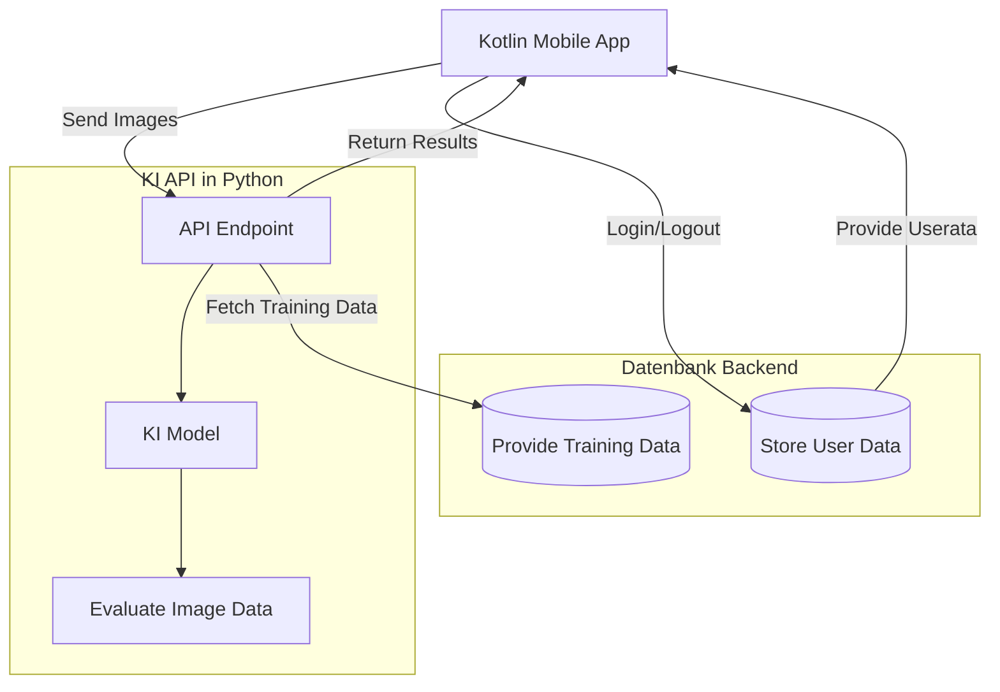

# DermaAI
DermaAI is the diploma project of the three students Jonas Maier, Daniel Jessner and Jonas Bogensberger for their graduation from the HTL Saalfelden for computer science in 2025. It involves the development of a mobile application that allows the user to view images of skin lesions using certain AI to have models evaluated. The AI ​​models are trained using self-collected medical data and then evaluated.

## Structure


## BackendAPI
### Building the Project
Building the project is simple and can be done with the following command:
```
sudo docker compose up --build
```
This will start:

- a Redis container for caching data
- a MongoDB instance for persistent storage
- and the backend itself

### Routes
You can find route information at:
```
localhost:3333/docs
```

## DataCollector
To set up the DataCollector, build and run the Docker container:
``` 
sudo docker build -t my-app .
sudo docker run -p 3333:3333 .
```
Routes
---
A simple Swagger UI is available at:
```
localhost:6969/docs
```
Keep in mind that the only interesting route for the user is the seed route, for filling the Database with the HAM-10000 Dataset.