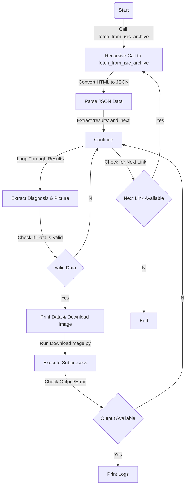

```mermaid
graph TD;
    A(Start) -->|Call fetch_from_isic_archive| B[Fetch HTML from URL];
    B -->|Convert HTML to JSON| C[Parse JSON Data];
    C -->|Extract 'results' and 'next'| D[Process Data];
    D -->|Loop Through Results| E[Extract Diagnosis & Picture];
    E -->|Check if Data is Valid| F{Valid Data};
    F --No--> D[Skip Iteration];
    F --Yes--> G[Print Data & Download Image];
    G -->|Run DownloadImage.py| H[Execute Subprocess];
    H -->|Check Output/Error| I{Output Available};
    I --Yes--> J[Print Logs];
    I --No--> D[Continue];
    D -->|Check for Next Link| K{Next Link Available};
    K --Yes--> B[Recursive Call to fetch_from_isic_archive];
    K --No--> L[End];
```

